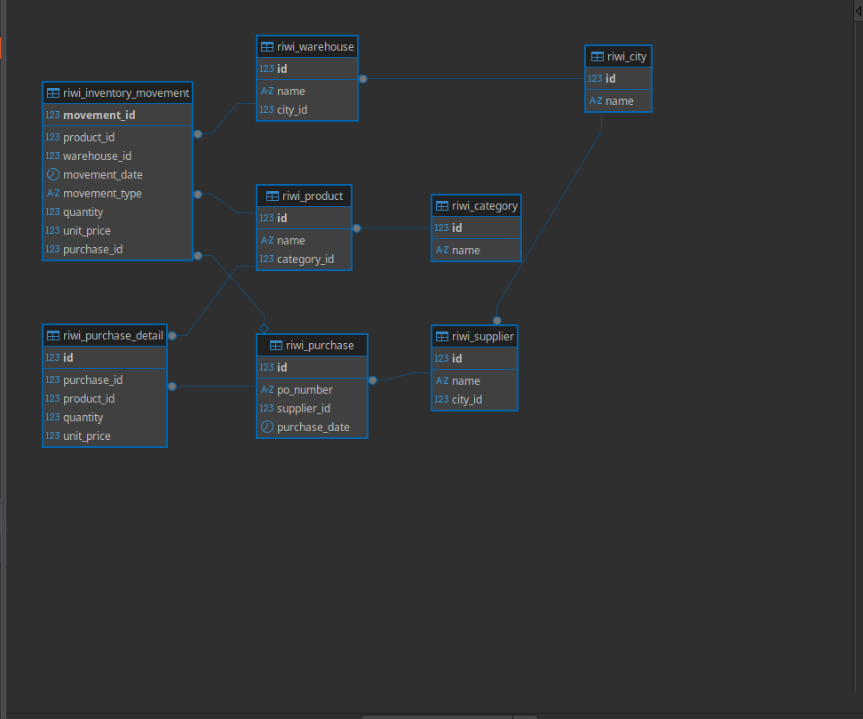

<h1 align="center">RiwiSupply S.A.S. — Relational Database Project</h1>

<p align="center">
  
</p>

## Project description

RiwiSupply S.A.S. is a company that distributes industrial supplies nationwide.
Its purchasing, inventory, supplier, and warehouse data was originally kept in a
single denormalized Excel file, maintained by different areas without a shared
standard. This caused duplicated suppliers, inconsistent product names, repeated
warehouse records, and unreliable reporting.

This project analyzes the raw dataset, normalizes it up to Third Normal Form
(3NF), designs an Entity-Relationship Model, and implements a relational
database in MySQL that can be loaded, queried, and maintained consistently.

## Technologies used

- MySQL 8.0+ (DDL / DML / views / stored procedure)
- Python 3 (data cleaning script used to build the load CSVs)
- draw.io (Entity-Relationship diagram, `.drawio` source)
- Graphviz (PDF/PNG render of the same diagram)

## Database engine used

MySQL 8.0. All scripts use standard MySQL syntax (`AUTO_INCREMENT`, `ENUM`,
`CHECK` constraints, `DELIMITER` for the stored procedure).

## Normalization process

### Original structure (raw_data sheet)

One flat table with the columns:
`MovementDate, SupplierName, SupplierCity, Warehouse, WarehouseCity,
ProductName, Category, Quantity, UnitPrice, MovementType, PurchaseOrder`

### Problems identified

- **Supplier duplicates with different formats**: e.g. `"Aceros del Norte
  S.A.S"`, `"Aceros del Norte"`, `"ACEROS NORTE"` all refer to the same
  supplier. Same pattern for `"Industriales SAS"`, `"INDUSTRIALES SAS"`,
  `"Industriales S.A.S"`.
- **City name inconsistencies**: `"Cartagena"` / `"Ctg"`, `"Barranquilla"` /
  `"Barranquila"` / `"B/quilla"`, `"Santa Marta"` / `"Sta Marta"`.
- **Warehouse duplicates**: `"Bodega Central"` and `"Bod. Central"` are the
  same warehouse.
- **Product name inconsistencies**: `"Disco de Corte 4.5"` / `"Disco Corte
  4.5"`, `"Guante Nitrilo"` / `"Guantes de Nitrilo"`, `"Electrodo E6013"` /
  `"Soldadura E6013"`.
- **Category duplicates**: `"Herramienta"` / `"Herramientas"`, `"Consumible"`
  / `"Consumibles"`, `"EPP"` / `"Elementos Protección"`.
- **PurchaseOrder reused inconsistently**: the same `PurchaseOrder` value
  (e.g. `PO-1035`, `PO-1041`) appears linked to different suppliers and
  products in the raw file. This means `PurchaseOrder` cannot be used as a
  natural/primary key; a surrogate `purchase_id` was introduced instead.

### 1NF — First Normal Form

Every column already held a single atomic value (no repeating groups), but
the table had no defined primary key and mixed several business entities
(supplier, warehouse, product, movement) in the same row. A surrogate key
(`movement_id`) was defined for every row to guarantee uniqueness.

### 2NF — Second Normal Form

Since the row-level key is a single surrogate column (not composite), there
are no partial dependencies by definition. Conceptually, attributes such as
`SupplierCity` do not depend on the full transactional row but only on the
supplier itself — this is addressed together with 3NF below.

### 3NF — Third Normal Form

Removed transitive dependencies by extracting every entity into its own
table with its own primary key:

- `SupplierCity` depended on `SupplierName`, not on the movement → extracted
  `riwi_city` and `riwi_supplier` (supplier references its city).
- `WarehouseCity` depended on `Warehouse`, not on the movement → extracted
  `riwi_warehouse` (warehouse references its city).
- `Category` depended on `ProductName`, not on the movement → extracted
  `riwi_category` and `riwi_product` (product references its category).
- `PurchaseOrder` data (supplier, date) does not depend on each product line
  → extracted `riwi_purchase` (header) and `riwi_purchase_detail` (line
  items), only created for movements where `MovementType = IN`.
- The remaining transactional fact (date, type, quantity, unit price,
  product, warehouse) stays in `riwi_inventory_movement`, with an optional
  link to the purchase that originated it.

### Final normalized result

8 tables: `riwi_city`, `riwi_supplier`, `riwi_category`, `riwi_product`,
`riwi_warehouse`, `riwi_purchase`, `riwi_purchase_detail`,
`riwi_inventory_movement`. See the diagram below.

## Database structure

All table and column names are in English and use the `riwi_` prefix, as
required.

| Table | Description |
|---|---|
| `riwi_city` | Catalog of cities |
| `riwi_supplier` | Suppliers, linked to a city |
| `riwi_category` | Product categories |
| `riwi_product` | Products, linked to a category |
| `riwi_warehouse` | Warehouses, linked to a city |
| `riwi_purchase` | Purchase header (supplier, PO number, date) |
| `riwi_purchase_detail` | Purchase line items (product, quantity, price) |
| `riwi_inventory_movement` | IN/OUT inventory movements per product and warehouse |

Constraints implemented: `PRIMARY KEY`, `FOREIGN KEY`, `UNIQUE`, `NOT NULL`
(all columns are required by default in MySQL unless stated otherwise), and
`CHECK` constraints for positive quantities and non-negative prices.

## Entity Relationship Model

- Source file (editable): `diagram/Mer_Riwi_supply.drawio` (open with
  [app.diagrams.net](https://app.diagrams.net)).

## Instructions to create the database

```bash
mysql -u <user> -p < ddl/01_create_database.sql
mysql -u <user> -p < ddl/02_create_tables.sql
```

> Rename the database in `01_create_database.sql` to match the required

## Instructions to load data


**INSERT INTO (works everywhere, no server flags needed):**

```bash
mysql -u <user> -p bd_gustavo_guzman_micaela < data/insert_data.sql
```

## Explanation of each SQL query

All queries are in `queries/consultas.sql`:

1. **Stock disponible por producto** — sums `IN` movements minus `OUT`
   movements per product, so inventory staff can plan future purchases.
2. **Movimientos de inventario con detalle** — joins movements with product
   and warehouse (and warehouse city) so logistics can review activity per
   warehouse.
3. **Total comprado por proveedor** — joins purchases and purchase details
   grouped by supplier, giving purchasing staff the total value bought from
   each one.
4. **Cantidad de movimientos por bodega** — counts movements per warehouse to
   identify the busiest locations.
5. **Producto con mayor volumen de compras** — sums purchased quantity per
   product and returns the top one (highest rotation).
6. **Valor total del inventario por bodega** — nets `IN` value minus `OUT`
   value per warehouse to estimate the economic value stored in each one.

## DML scripts

- `dml/insert.sql` — registers a new supplier and an associated product.
- `dml/update.sql` — updates an existing supplier's city.
- `dml/delete.sql` — deletes a product only if it has no associated
  inventory movements or purchase details (referential integrity is
  respected via an `EXISTS` guard, not by disabling constraints).

## Other queries

- **Two SQL views** (`extra/views.sql`):
  - `riwi_vw_stock_by_product`: operational view of current stock per
    product.
  - `riwi_vw_purchases_by_supplier`: analytical view summarizing purchased
    value and order count per supplier.
- **Stored procedure** (`extra/procedure.sql`): `riwi_sp_get_supplier(IN
  p_supplier_id INT)`. If a supplier id is passed, returns that supplier's
  data; if `NULL` is passed, returns all suppliers.

## Developer information

- **Full name:** Gustavo Andrés Guzmán Mejía
- **Clan:** Micaela